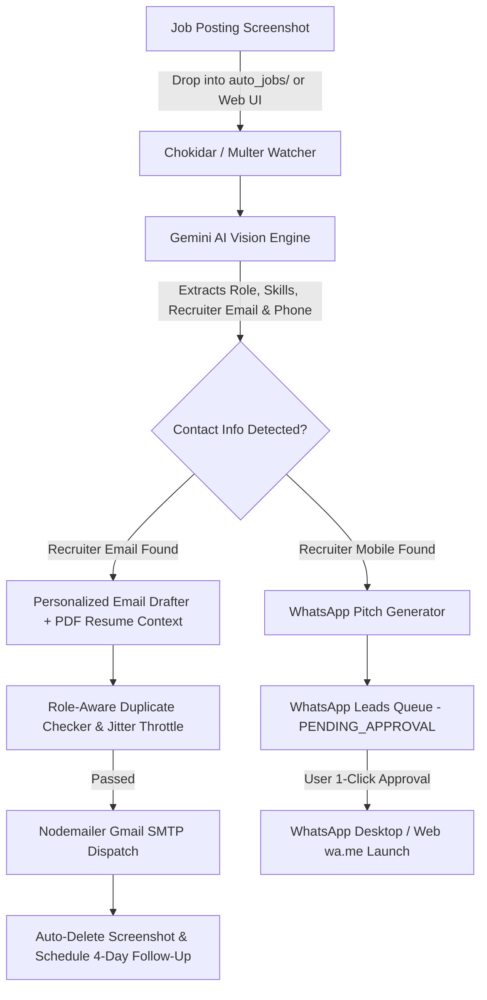

# 🚀 Auto Job Apply AI

> **Autonomous AI-Powered Job Application Engine & Recruiter Outreach Suite**
> 
> *Drop job screenshots into a folder → AI analyzes requirements + your resume → Drafts natural, anti-AI cold emails & WhatsApp pitches → Dispatches automatically with resume attachments, duplicate prevention, rate throttling, and smart follow-up reminders.*

---

## 🌟 Key Features

### 1. 🤖 Continuous Auto-Pilot Folder Watcher
* **Zero-Interface Operation**: Simply save or drag job posting screenshots (PNG, JPG, WEBP, HEIC) into the `auto_jobs/` directory.
* **Instant Processing**: Real-time file system watcher (`chokidar`) detects new job postings in milliseconds.
* **Auto-Cleanup**: Automatically deletes processed screenshots after successful email delivery to keep your workspace clutter-free.

### 2. 🧠 Multimodal AI Vision & Resume-Context Personalization
* **Deep OCR & Role Extraction**: Powered by Google Gemini Vision models (`gemini-3.1-flash-lite`, `gemini-3.5-flash`, `gemini-3.7-flash` with automatic fallback retry).
* **Multi-Screenshot Support**: Seamlessly parses long, scrolling job descriptions spanning up to 5 multi-part screenshots.
* **Resume-Aware Personalization**: Ingests your candidate resume PDF directly into the AI context to highlight concrete projects, tech stacks (AWS, Kubernetes, Terraform, Docker, CI/CD), and quantifiable metrics.

### 3. ✍️ Anti-AI Human Writing Engine
* **No Robotic Clichés**: Strict prompt engineering eliminates dead giveaways like *"I am thrilled to apply"*, *"tapestry"*, *"beacon"*, *"invaluable asset"*, or *"proven track record"*.
* **Crisp, Engineer-to-Recruiter Voice**: Concise (100–140 words), direct, and personalized to the hiring manager or company team.
* **Automatic Signature**: Appends full professional contact details and clickable links.

### 4. 💬 Recruiter WhatsApp Outreach Pipeline
* **Mobile Number Detection**: Extracts recruiter mobile/WhatsApp numbers (supports Indian 10-digit, `+91`, `0` prefixes, and international formats).
* **AI WhatsApp Pitch Generation**: Drafts concise, conversational WhatsApp messages (<90 words) tailored to the specific role.
* **1-Click Approval & Dispatch**: Preview, edit, and click **`🚀 Open in WhatsApp`** to launch WhatsApp Desktop / Web (`https://wa.me/...`) with prefilled outreach text.
* **Phone-Only Postings Handled**: Postings with only a phone number are shortlisted automatically rather than skipped.

### 5. 🛡️ Role-Aware Duplicate Application Protection
* **Smart Recruiter Memory**: Distinguishes between same-role spam vs. multiple distinct openings posted by the same agency/recruiter.
* **In-Flight Lock Protection**: Prevents race conditions during rapid multi-file drops.
* **Manual Override**: Allows force resends with explicit confirmation if desired.

### 6. ⏱️ Outbound Throttling & Humanized Jitter
* **Sender Reputation Guard**: Enforces daily send limits (default: 150/day, customizable via UI or `.env`) to avoid triggering Gmail spam algorithms.
* **Dynamic Human Jitter**: Injects natural 15s–35s delays between emails to mimic authentic human cadence.

### 7. 📅 Smart 4-Day Automated Follow-Up Cadence
* **Automated Scheduling**: Automatically queues a polite, brief follow-up reminder 4 business days after initial application.
* **Due Date Dispatcher**: Auto-dispatches due follow-ups with re-attached resumes.
* **Status Tracking**: Mark recruiter replies to automatically close follow-up sequences.

---

## 🏗️ Architecture & Tech Stack



* **Runtime**: Node.js (v18+) & Express
* **AI & Vision**: Google Generative AI (Gemini 3.1 / 3.5 / 3.7 / 3.8 Flash)
* **Email Transport**: Nodemailer (Gmail SMTP + App Password)
* **File Watcher**: Chokidar (Event-driven file system monitoring)
* **Frontend**: Vanilla Modern Glassmorphism CSS, Responsive Grid, Real-Time Polling Dashboard

---

## 📦 Getting Started

### 1. Prerequisites
* [Node.js](https://nodejs.org/) (v18 or newer)
* [Google Gemini API Key](https://aistudio.google.com/apikey) (Free tier available)
* [Gmail App Password](https://myaccount.google.com/apppasswords) (Requires 2-Step Verification)

### 2. Installation
```bash
# Clone the repository
git clone https://github.com/ajayautade/auto-job-apply.git
cd auto-job-apply

# Install dependencies
npm install
```

### 3. Configuration
Copy the example environment file and fill in your credentials:
```bash
cp .env.example .env
```

Edit `.env` with your settings:
```env
# Gemini API Key
GEMINI_API_KEY=your_gemini_api_key_here

# Gmail SMTP Configuration
GMAIL_USER=your_email@gmail.com
GMAIL_APP_PASSWORD=your_16_char_app_password

# Candidate Profile Details
YOUR_NAME=Er. Ajay Autade
YOUR_TITLE=DevOps Engineer | Computer Science Engineer
YOUR_EMAIL=your_email@gmail.com
YOUR_PHONE=+91 9545034120
YOUR_PORTFOLIO=https://ajayautade.com
YOUR_LINKEDIN=https://linkedin.com/in/ajayautadepatil
YOUR_GITHUB=https://github.com/ajayautade

# Outbound Throttling & Follow-Up
DAILY_SEND_LIMIT=150
MIN_JITTER_SECONDS=15
MAX_JITTER_SECONDS=35
FOLLOW_UP_DAYS=4
```

### 4. Upload Your Resume
Place your resume PDF in `public/uploads/resumes/` or upload it directly through the dashboard UI.

### 5. Launch Application
```bash
# Start in development mode (with auto-reload)
npm run dev

# Or start standard production server
npm start
```

Visit **`http://localhost:3000`** in your browser to access the dashboard.

---

## 🖥️ Dashboard Overview

| Tab | Purpose |
|---|---|
| **🤖 Auto-Pilot Watcher** | Real-time status, watch folder path, daily outbound quota meter, human jitter status, and live activity history log. |
| **✍️ Manual Upload** | Drag-and-drop multi-part screenshots, live AI extraction review, email editor with duplicate warnings, and resume attachment indicators. |
| **📅 Follow-Up Cadence** | Tracks scheduled follow-ups, due dates, recruiter reply status, and 1-click follow-up dispatch. |
| **💬 WhatsApp Outreach** | Review recruiter mobile numbers, edit tailored pitch drafts, and dispatch directly to WhatsApp Web/Desktop with 1 click. |

---

## 🔒 Security & Privacy Best Practices

* **No Hardcoded Secrets**: Sensitive API keys and Gmail App Passwords are read strictly from `.env` (which is excluded via `.gitignore`).
* **Safe SMTP Transport**: Uses SSL/TLS with Google App Passwords; no main account passwords required.
* **Local Processing**: Screenshots and resumes remain on your local machine; only text and image contents are sent to the Gemini API for analysis.

---

## 📄 License

This project is licensed under the MIT License — see the [LICENSE](LICENSE) file for details.

---

## 👤 Author

**Er. Ajay Autade**
* 🌐 Portfolio: [ajayautade.com](https://ajayautade.com)
* 💼 LinkedIn: [linkedin.com/in/ajayautadepatil](https://linkedin.com/in/ajayautadepatil)
* 🐙 GitHub: [@ajayautade](https://github.com/ajayautade)
