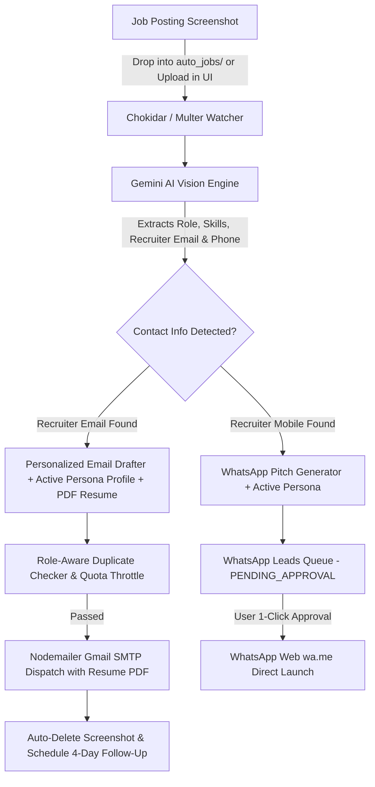

# 🚀 Auto Job Apply AI

> **Universal Autonomous AI-Powered Job Application Engine & Multi-Channel Recruiter Outreach Suite**
> 
> *Drop job screenshots into a folder → AI extracts requirements + your resume → Drafts human cold emails & WhatsApp pitches tailored to your exact persona and skills → Dispatches automatically with resume attachments, duplicate protection, daily rate throttling, and smart follow-up reminders.*

---

## 🌍 Built for Any Job Role & Candidate

Auto Job Apply AI is **100% customizable for any candidate and job domain**. Whether you are a **Full Stack Developer**, **Backend Engineer**, **DevOps / Cloud Specialist**, **Frontend Engineer**, **AI/ML Practitioner**, **Data Scientist**, **QA / SDET**, or in a **Custom Industry**, you can tailor your candidate profile, core technical strengths, custom AI pitch instructions, and signature in seconds.

---

## 🌟 Key Features

### 1. ⚙️ Universal AI Persona & Profile Customizer (8 Built-In Presets)
* **1-Click Role Presets**:
  * 🚀 **DevOps & Cloud Engineer** (AWS, Kubernetes, Terraform, Docker, CI/CD, Prometheus)
  * 💻 **Full Stack Developer** (React, Node.js, TypeScript, Next.js, PostgreSQL, MongoDB)
  * ⚙️ **Backend Engineer** (Distributed Systems, APIs, Python, Go, Java, Microservices, Redis)
  * 🎨 **Frontend / UI Engineer** (React, Next.js, TypeScript, Tailwind CSS, Core Web Vitals)
  * 🧠 **AI / ML Engineer** (LLMs, RAG, PyTorch, LangChain, OpenAI/Gemini APIs, Vector DBs)
  * 📊 **Data Scientist / Analyst** (Python, SQL, Pandas, Tableau, Predictive Modeling)
  * 🧪 **QA Automation / SDET** (Cypress, Playwright, Selenium, Postman, Jest)
  * 🛠️ **Custom Role** (Completely configurable for any domain)
* **Dynamic Custom AI Instructions**: Provide arbitrary guidance to the AI (e.g. *"Highlight my e-commerce project with 50k users, mention 3 years experience, note 15-day notice period"*).
* **Live AI Persona Preview**: See in real-time how the AI will introduce you in outbound cold emails.
* **Auto-Generated & Editable Signatures**: Clickable links, phone numbers, and professional formatting.

### 2. 🎯 AI Recruiter & HR Lead Finder & Cold Outreach Engine
* **Target Company Lead Discovery**: Enter single or bulk target companies/domains (e.g. *Razorpay, Postman, Hasura, Cred, Swiggy, Zepto, Atlassian*).
* **Corporate Email Pattern Intelligence**: Predicts and resolves verified HR, Talent Acquisition Lead, Technical Recruiter, and Hiring Manager contact points (`first.last@company.com`, `careers@company.com`, `talent@company.com`, etc.).
* **Automated Cold Outreach with Resume**: Drafts company-specific cold emails highlighting candidate's verified skills and portfolio (`https://ajayautade.com`), attaches the candidate's PDF resume, and dispatches via Gmail SMTP.
* **Dual Dispatch Modes**: Choose between **Review & 1-Click Dispatch / Batch Send** or **Autonomous Instant Dispatch**.

### 3. 🤖 Continuous Auto-Pilot Folder Watcher (Zero-Click)
* **Drop & Forget**: Simply save or drag job posting screenshots (PNG, JPG, WEBP, HEIC) into the `auto_jobs/` directory.
* **Real-Time Watcher**: Event-driven file system monitoring (`chokidar`) detects and processes incoming job postings in milliseconds.
* **Auto-Cleanup**: Automatically removes processed screenshots after successful delivery to keep your workspace organized.

### 4. 🧠 Multimodal AI Vision & Resume-Context Ingestion
* **Deep OCR & Role Extraction**: Powered by Google Gemini Vision models (`gemini-3.1-flash-lite`, `gemini-3.5-flash`, `gemini-3.7-flash` with automatic fallback).
* **Multi-Screenshot Support**: Seamlessly analyzes long scrolling job postings spanning multiple screenshots.
* **Resume-Aware Personalization**: Ingests your candidate resume PDF directly into the Gemini AI prompt to extract genuine work achievements, specific frameworks, and quantifiable metrics.

### 5. ✍️ Anti-AI Human Writing Engine
* **Zero Robotic Clichés**: Strict prompt constraints prevent dead giveaways like *"I am thrilled to apply"*, *"tapestry"*, *"beacon"*, *"invaluable asset"*, or *"proven track record"*.
* **Authentic Tone**: Concise (100–140 words), direct, and written engineer-to-engineer / professional-to-recruiter with live project links to your portfolio.

### 6. 💬 Recruiter WhatsApp Outreach Pipeline
* **Mobile Number Extraction**: Automatically detects recruiter phone numbers from job screenshots (supports Indian standard 10-digit, `+91`, `0` prefixes, and international formats).
* **AI WhatsApp Pitch Generation**: Drafts concise, conversational WhatsApp messages (<90 words) tailored to the role.
* **1-Click WhatsApp Dispatch**: Preview, edit, and click **`🚀 Open in WhatsApp`** to launch WhatsApp Web/Desktop (`https://wa.me/...`) with prefilled outreach text.

### 7. 🛡️ Role-Aware Duplicate Protection
* **Smart Recruiter Memory**: Distinguishes between spamming the same job vs. applying to multiple distinct openings posted by the same agency/recruiter.
* **In-Flight Lock Protection**: Prevents race conditions during rapid multi-file drops.

### 8. ⏱️ Outbound Throttling & Humanized Jitter
* **Sender Reputation Guard**: Enforces daily send limits (default: 150/day, customizable via UI or `.env`) to safeguard Gmail accounts.
* **Dynamic Jitter**: Injects natural delays between emails to mimic human sending cadence.

### 9. 📅 Smart 4-Day Automated Follow-Up Cadence
* **Automated Scheduling**: Automatically queues a polite, brief follow-up reminder 4 business days after initial application.
* **Due Date Dispatcher**: Auto-dispatches due follow-ups with re-attached resumes.

---

## 🏗️ System Workflow



---

## 📖 Step-by-Step User Guide (Start in 2 Minutes)

### Step 1: Clone Repository & Install Dependencies
```bash
git clone https://github.com/ajayautade/auto-job-apply.git
cd auto-job-apply
npm install
```

### Step 2: Configure Environment Credentials
Create your `.env` file from the provided example:
```bash
cp .env.example .env
```
Fill in your credentials:
```env
# 1. Google Gemini API Key (Free tier from https://aistudio.google.com/apikey)
GEMINI_API_KEY=your_gemini_api_key_here

# 2. Gmail SMTP & App Password (From https://myaccount.google.com/apppasswords)
GMAIL_USER=your_email@gmail.com
GMAIL_APP_PASSWORD=xxxx xxxx xxxx xxxx

# 3. Default Sender Details (Can also be edited anytime in UI)
YOUR_NAME=Your Name
YOUR_TITLE=Your Professional Title
YOUR_EMAIL=your_email@gmail.com
YOUR_PHONE=+91 XXXXXXXXXX
YOUR_PORTFOLIO=https://yourportfolio.com
YOUR_LINKEDIN=https://linkedin.com/in/username
YOUR_GITHUB=https://github.com/username

# 4. Outbound Quota & Jitter
DAILY_SEND_LIMIT=150
MIN_JITTER_SECONDS=15
MAX_JITTER_SECONDS=35
FOLLOW_UP_DAYS=4
```

### Step 3: Launch the Application
```bash
# Start development server
npm run dev

# Or start standard production server
npm start
```
Open **`http://localhost:3000`** in your browser.

### Step 4: Customize Your Persona in the Dashboard
1. Click the **`⚙️ AI Persona & Profile`** tab.
2. Select your role preset (e.g. *Full Stack Developer*, *DevOps*, *Backend*, *AI/ML*, etc.) or choose *Custom Persona*.
3. Edit your **Target Roles**, **Core Technical Skills**, and **Custom AI Context** (tell the AI what highlights or projects to emphasize).
4. Click **`Attach / Change Resume`** to upload your resume PDF.
5. Click **`Save Profile & Apply Changes`**.

### Step 5: Start Applying!
* **Option A (Auto-Pilot):** Drop job screenshots into `auto_jobs/`. The AI engine will analyze, tailor, attach your resume, and send cold emails autonomously.
* **Option B (Manual Mode):** Upload screenshots on the **Manual Upload** tab, review the AI draft, make any edits, and click send.
* **WhatsApp Outreach:** Check the **`💬 WhatsApp Outreach`** tab to approve and send 1-click messages to recruiter phone numbers found in job posts.
* **Follow-Ups:** Check the **`📅 Follow-Up Cadence`** tab to see pending follow-ups scheduled 4 days out.

---

## 🖥️ Dashboard Tabs Overview

| Tab | Purpose |
|---|---|
| **🤖 Auto-Pilot Watcher** | Real-time status, watch folder path, daily outbound quota meter, human jitter status, and live activity history log. |
| **⚙️ AI Persona & Profile** | 1-click role presets, skills configurator, custom AI pitch prompt editor, CV uploader, live preview, and email signature manager. |
| **✍️ Manual Upload** | Drag-and-drop multi-part screenshots, live AI extraction review, email editor with duplicate warnings, and resume attachment indicators. |
| **📅 Follow-Up Cadence** | Tracks scheduled follow-ups, due dates, recruiter reply status, and 1-click follow-up dispatch. |
| **💬 WhatsApp Outreach** | Review recruiter mobile numbers, edit tailored pitch drafts, and dispatch directly to WhatsApp Web/Desktop with 1 click. |
| **📖 Step-by-Step Guide** | Interactive onboarding guide with direct links for API keys and setup workflows. |

---

## 🔒 Security & Privacy Best Practices

* **No Hardcoded Secrets**: Sensitive API keys and Gmail App Passwords are read strictly from `.env` (which is excluded via `.gitignore`).
* **Safe SMTP Transport**: Uses SSL/TLS with Google App Passwords; your primary Google password is never exposed.
* **Local Data Storage**: All history and profile data are stored locally on your machine in `user_profile.json` and `auto_jobs/`.

---

## 📜 License

MIT License © 2026. Built with passion for engineers, developers, and job seekers everywhere.
